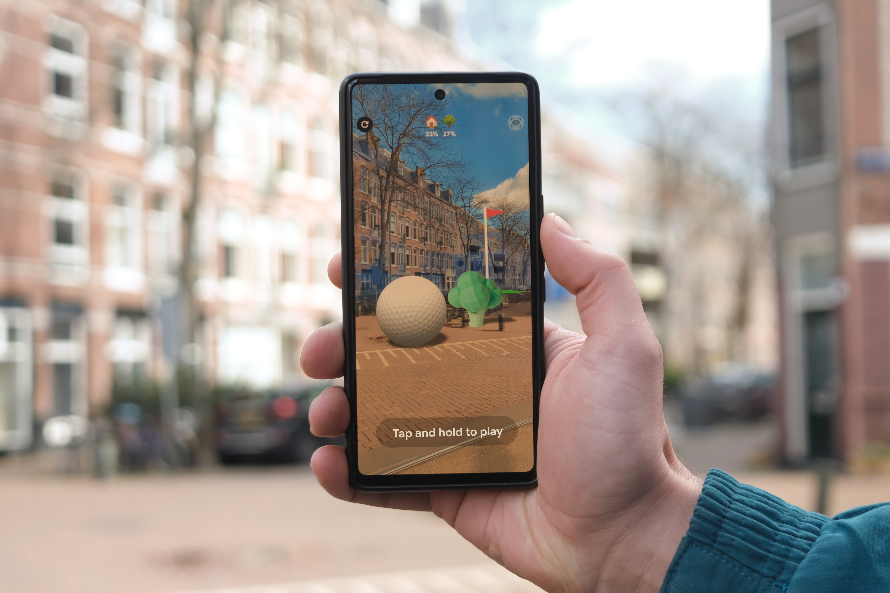
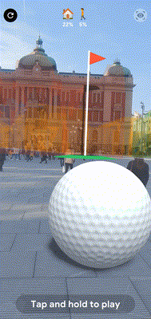
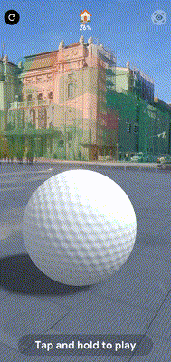
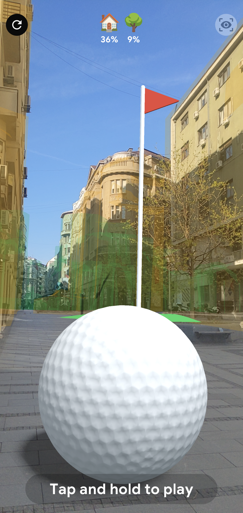
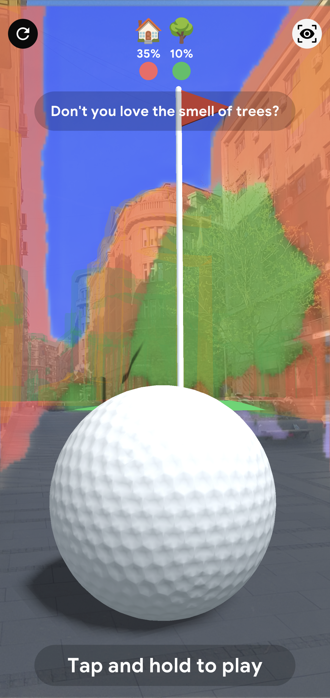
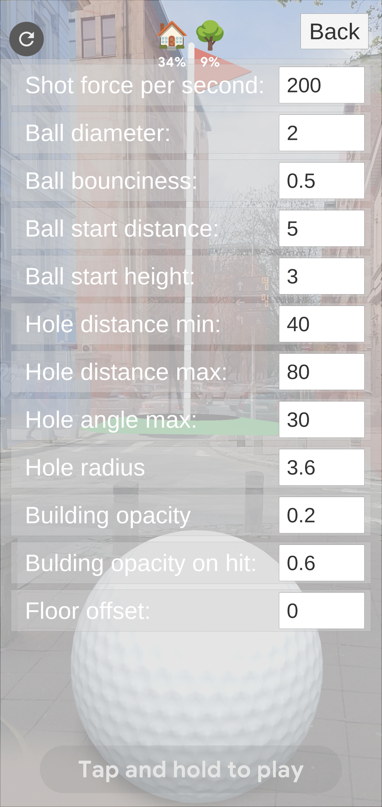

# Mega Golf
A geospatial and semantic play experience in the city
by oio (https://oio.studio/)

## What is Mega Golf?
Mega Golf is a simple mini-golf style game that you can play in augmented reality in your neighborhood, powered by ARCore.

With the [Streetscape Geometry API](https://developers.google.com/ar/develop/unity-arf/geospatial/streetscape-geometry), your location transforms into a Mega Golf course in AR. In this demo, a hole is placed up to 80m from your location and a mega golf ball is placed in front of you. You can use the buildings around you to bounce the ball around obstacles and score points. 

As you play, the [Scene Semantics API](https://developers.google.com/ar/develop/scene-semantics) makes you more aware of your surroundings, informing you about people, moving vehicles, or other city and landscape elements around you.

Every street, square or corner around you can become a unique Mega Golf course! Only available in supported regions with [Street View coverage](https://www.google.com/streetview/how-it-works/).

## How does it work?
The Mega Golf Unity project can be built to create a mobile game/app.
The project uses Unity 2022.2.8f1 and Google's ARCore Geospatial API.

By combining Google Street View data, the user’s GPS coordinates and the image from the user’s device camera, the Streetscape Geometry API provides geometry of the buildings and terrain around your position  in real time. Combining this geometry with virtual objects such as the golf ball and the hole, this demo creates a playground where the ball can roll on the terrain and bounce off buildings. In addition, obstacles can spawn on the terrain, and the hole lets a ball pass through the ground.

The gameplay is simple: a very mega golf ball and a mega hole is spawned in front of you. 
Rotate to face the hole, tap and hold to decide the strength and try to putt it in the hole.
If you fail, a new ball will spawn in front of you. If you succeed, an obstacle will be placed in front of you, so you will need to find a way to score, by bouncing around it. You can spawn as many balls as you want from where you are, no need to walk around…and keep out of the streets!

You can always refresh with the button on the right if you are not happy about the position. Thanks to an algorithm that you can see in the code, the hole and obstacles are always outside of the building meshes. 

Additionally, by analyzing the current camera image, the Semantics API detects items currently on screen (trees, people, cars…). The labels and the confidence value are used to create a set of notifications and in-game messaging to make the user aware of their surroundings. You can turn on and off the visualization of the Semantics layer by tapping on the icon on the top right.

## Requirements
Your app will require the following:

* Internet and GPS access.
* The experience works best outdoors.
* A compatible device: Android: Google Pixel 2 or later device for optimum performance.

## Developer Setup
The app has not been released to the public on a mobile app store, but the code can be downloaded and built in Unity. The experience has only been tested on fairly recent Android phones, such as a Pixel or Samsung Galaxy 7 or higher.

### Unity App
* Download Unity version 2022.2.8f1 to ensure compatibility. We recommend using Unity Hub. Make sure you install Android build support.
* Clone this repo to your machine.
* Open the project in Unity 2022.2.8f1, and switch platform to Android.
* Follow the steps below in the 'ARCore Geospatial API Key' section.
* Build the app.
* Deploy to an ARCore compatible device.

### ARCore Geospatial API Key
You will need an API Key with ARCore Geospatial API enabled for your app to use Geospatial features. Follow the steps here to in order to setup an API key:
* In Unity, go to **Edit -> Project Settings**
* Under 'XR Plug-in Management', click on 'ARCore Extensions'
* Paste the Android API Key into the 'Android API Key' textfield
* Enable the 'Geospatial' optional feature

## Debug

If you tap the screen right under the Refresh button, a menu with settings for the game opens up. This is a hidden menu, which was used during development and debugging, that allows users to change various parameters of the game, such as ball and hole size, hole distance, opacity of the building visualizer and other variables.

This settings panel can be very useful to play in real life with scales and distances for your ARCore geospatial experiments.

### Attribution

**3D Models**

['Tomato' on Poly.Pizza](https://poly.pizza/m/dy99IaeE9lq) \
Author: Zoe XR \
License: CC BY 4.0

['Beet' on Poly.Pizza](https://poly.pizza/m/f2zAOPFIZnr) \
Author: Poly by Google \
License: CC BY 4.0

['Onion' on Poly.Pizza](https://poly.pizza/m/5TDOcmDQlCV) \
The 3D file was slightly modified \
Author: Poly by Google \
License: CC BY 4.0

**Sound effects**

[Intro](https://freesound.org/people/David_Jacob/sounds/474053/), Author: David\_Jacob, License: CC0 1.0 \
[Car honking](https://freesound.org/people/MicktheMicGuy/sounds/434878/), Author: MicktheMicGuy, License: CC0 1.0 \
[Collisions](https://freesound.org/people/Mafon2/sounds/264879/), Author: Mafon2, License: CC0 1.0 \
[Water Pouring](https://freesound.org/people/InspectorJ/sounds/421184/), Author: InspectorJ , License: CC BY 4.0 \
[Birds whistling](https://freesound.org/people/InspectorJ/sounds/456440/), Author: InspectorJ , License: CC BY 4.0 \
[Hello](https://freesound.org/people/Duisterwho/sounds/644584/), Author: Dusterwho, License: CC0 1.0 \
[Congrats](https://freesound.org/people/Fupicat/sounds/607207/), Author: Fupicat, License: CC0 1.0 \
All other assets created by oio and released under CC BY 4.0

### Contributions

*   [oio.studio](https://oio.studio/) | [Github](https://github.com/oio) | [Instagram](https://www.instagram.com/oio.studio/)

### License & Notes

[Apache 2.0 license](https://www.apache.org/licenses/LICENSE-2.0)

This is not an official Google product.

We encourage open sourcing projects as a way of learning from each other. Please respect our and other creators’ rights, including copyright and trademark rights when present, when sharing these works and creating derivative work.

You must disclose your use of ARCore Cloud Anchors or ARCore Geospatial API prominently in your application by including the following text in connection with the applicable API activation, including a “learn more” link to https://support.google.com/ar?p=how-google-play-services-for-ar-handles-your-data:

> To power this session, Google will process sensor data (e.g., camera and location).
[Learn more](https://support.google.com/ar/answer/12148145).

